# LoanLab

> Equipment loan management system for the iOS Digital Maker Space — Universidad de las Américas Puebla (UDLAP)

LoanLab is a full-stack web application designed to streamline the management of laboratory equipment loans. It supports three user roles — **Admin**, **Encargado** (supervisor), and **Usuario** (student) — each with its own dashboard, permissions, and workflows.

Built as a Social Service project at UDLAP.

---

## Screenshots

### Login
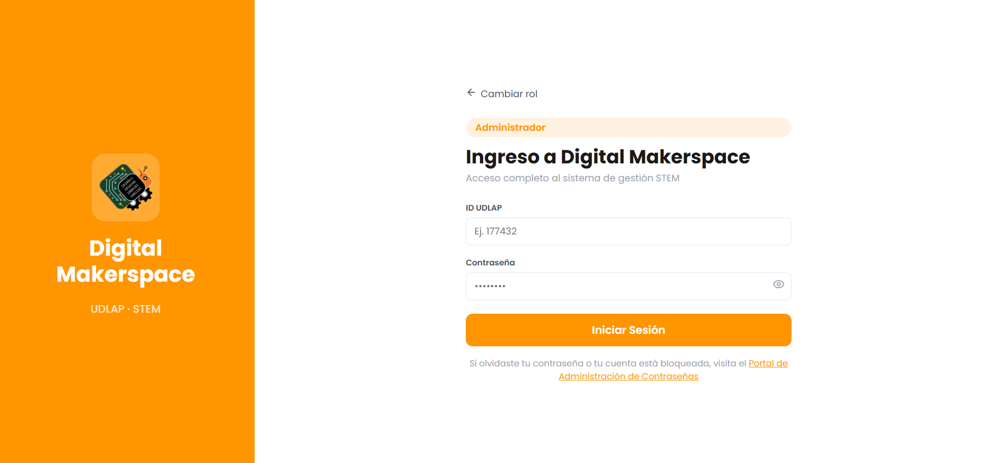

### Home — Admin
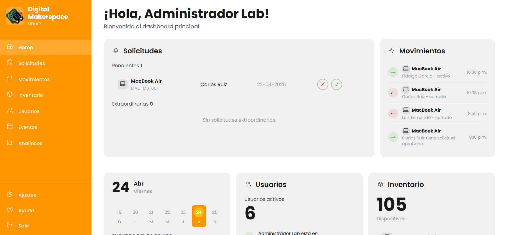
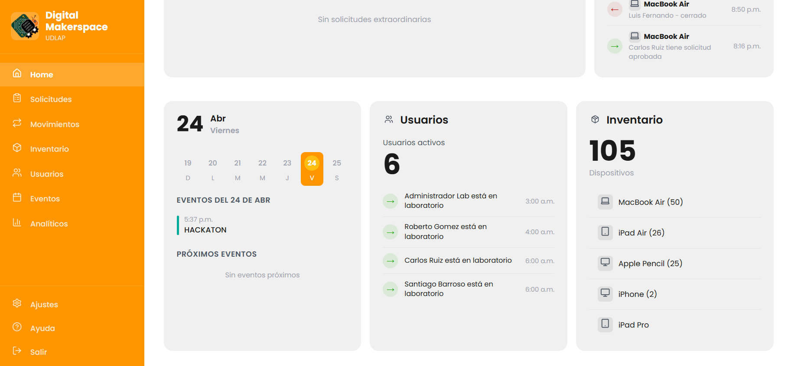

### Home — Usuario
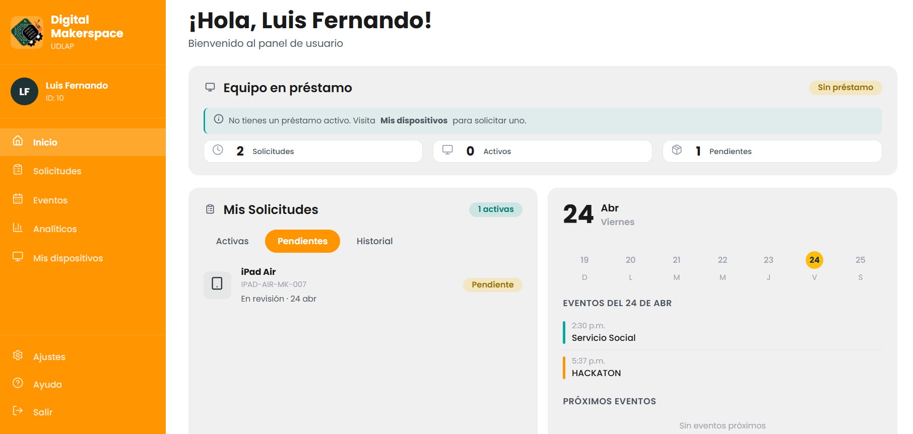

### Solicitudes (Loan Requests)
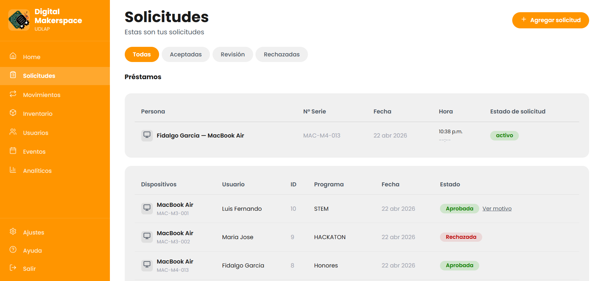
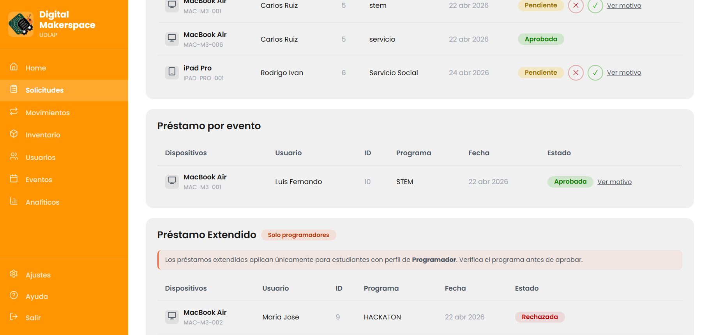

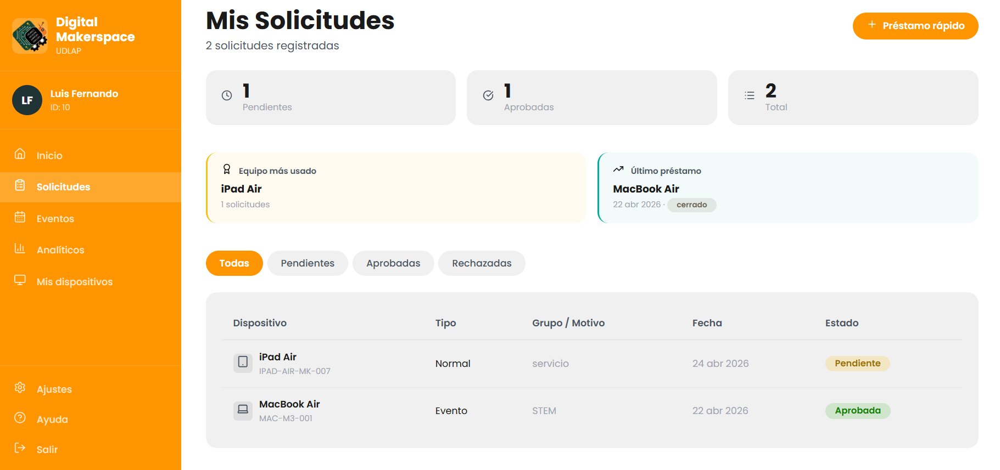


### Dispositivos (My Devices)

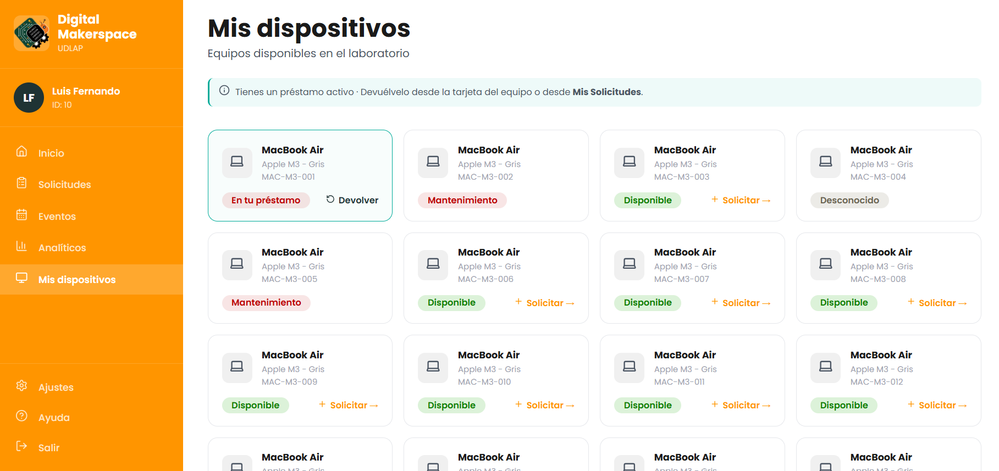
 

### Analíticos (Analytics)
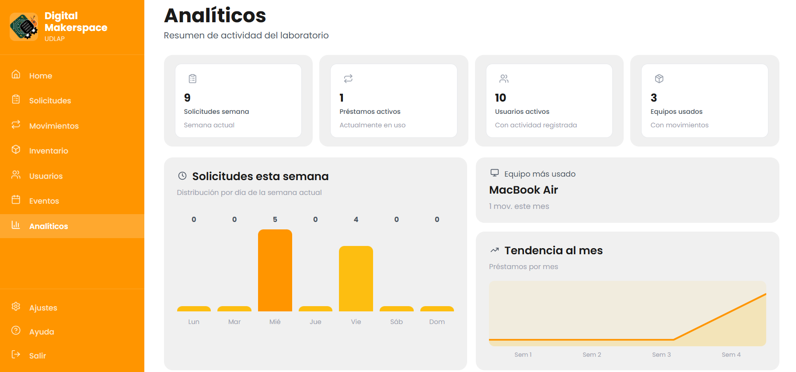
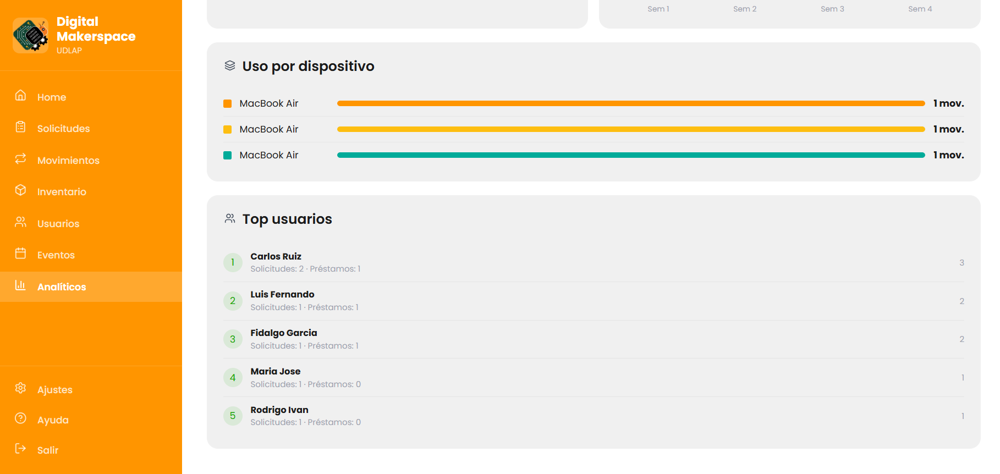


### Eventos (Events)
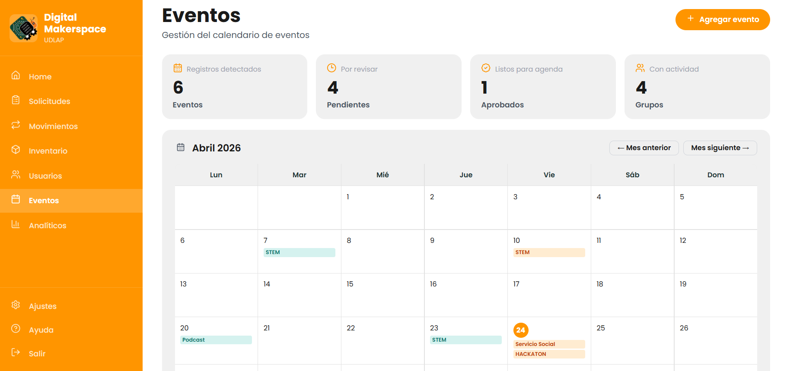
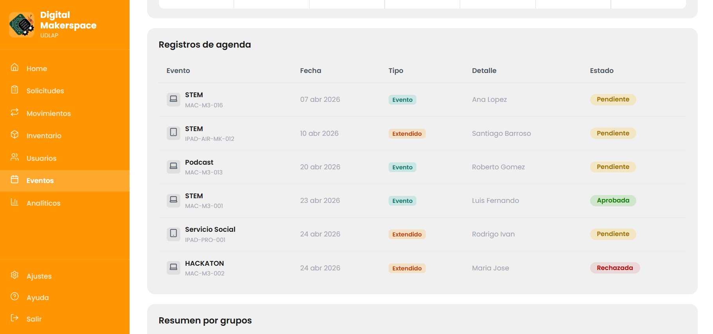

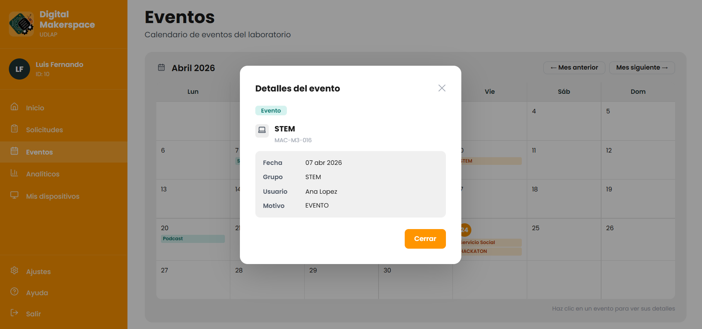


---

## Tech Stack

| Layer     | Technology                          |
|-----------|-------------------------------------|
| Frontend  | Angular 17 · TypeScript · Lucide    |
| Backend   | Django 4 · Django REST Framework    |
| Database  | MySQL (XAMPP · port 3307)           |
| Auth      | Session-based · localStorage        |
| Styling   | Global CSS · ViewEncapsulation.None |

---

## Project Structure

```
LoanLab/
├── backend/                  # Django REST API
│   ├── manage.py
│   ├── requirements.txt
│   ├── .env.example
│   └── core/
│       ├── models.py
│       ├── serializers.py
│       ├── views.py
│       └── urls.py
│
├── frontend/                 # Angular application
│   ├── angular.json
│   ├── package.json
│   └── src/
│       └── app/
│           ├── pages/
│           │   ├── admin/
│           │   ├── encargado/
│           │   └── usuario/
│           ├── services/
│           └── core/
│
├── screenshots/
└── README.md
```

---

## Features

### Role: Admin
- Full inventory management (create, edit, delete equipment)
- Approve or reject loan requests
- Interactive calendar with event filtering by day
- User management with loan history
- Analytics dashboard

### Role: Encargado (Supervisor)
- Approve and process loan requests
- Manage equipment return status
- View active loans and overdue items

### Role: Usuario (Student)
- Submit quick loan requests ("Préstamo rápido")
- Track request status (Pending / Approved / Rejected)
- Return equipment directly from the dashboard
- View personal analytics with activity heatmap (GitHub-style)
- Browse available devices ("Mis dispositivos")
- View lab event calendar with detail modals

---

## Local Setup

### Prerequisites
- Python 3.11+
- Node.js 18+
- MySQL via XAMPP (port **3307**)

---

### Backend

```bash
cd backend
python -m venv venv

# Windows
venv\Scripts\activate
# macOS / Linux
source venv/bin/activate

pip install -r requirements.txt
```

Create a `.env` file based on `.env.example`:

```env
DB_NAME=ioslab
DB_USER=root
DB_PASSWORD=
DB_HOST=localhost
DB_PORT=3307
SECRET_KEY=your-secret-key-here
DEBUG=True
```

Run migrations and start the server:

```bash
python manage.py migrate
python manage.py runserver
```

API available at: `http://127.0.0.1:8000/api/`

---

### Frontend

```bash
cd frontend
npm install
ng serve
```

App available at: `http://localhost:4200`

---

## Main API Endpoints

| Method | Endpoint               | Description              |
|--------|------------------------|--------------------------|
| POST   | `/api/solicitud/`      | Create a loan request    |
| GET    | `/api/solicitud/`      | List all requests        |
| PATCH  | `/api/solicitud/:id/`  | Update request status    |
| GET    | `/api/equipo/`         | List all equipment       |
| PATCH  | `/api/equipo/:id/`     | Update equipment status  |
| GET    | `/api/prestamo/`       | List all loans           |
| PATCH  | `/api/prestamo/:id/`   | Process equipment return |
| GET    | `/api/usuario/`        | List all users           |
| GET    | `/api/evento/`         | List all events          |

---

## Database Schema (key models)

```
Usuario         → id, nombre, email, rol, grupo
Equipo          → id, nombre, num_serie, marca, modelo, id_estado_equipo
Solicitud       → id, id_usuario_solicita, id_equipo, fecha_solicitud,
                   estado_solicitud, tipo_solicitud, grupo_solicitud, motivo
Prestamo        → id, id_solicitud, id_usuario, id_equipo,
                   fecha_inicio, fecha_fin, estado_prestamo
Evento          → id, titulo, fecha, tipo, grupo, detalle
```

---

## Deployment notes

- Set `DEBUG=False` in `.env` before deploying
- Configure `ALLOWED_HOSTS` in `settings.py`
- Run `ng build --configuration production` for the Angular bundle
- Serve the `dist/` folder via Nginx or any static file server

---

## License

This project was developed as a Social Service requirement at **UDLAP**.  
Internal use only — not licensed for public distribution.

---

<p align="center">
  iOS Digital Maker Space
</p>
